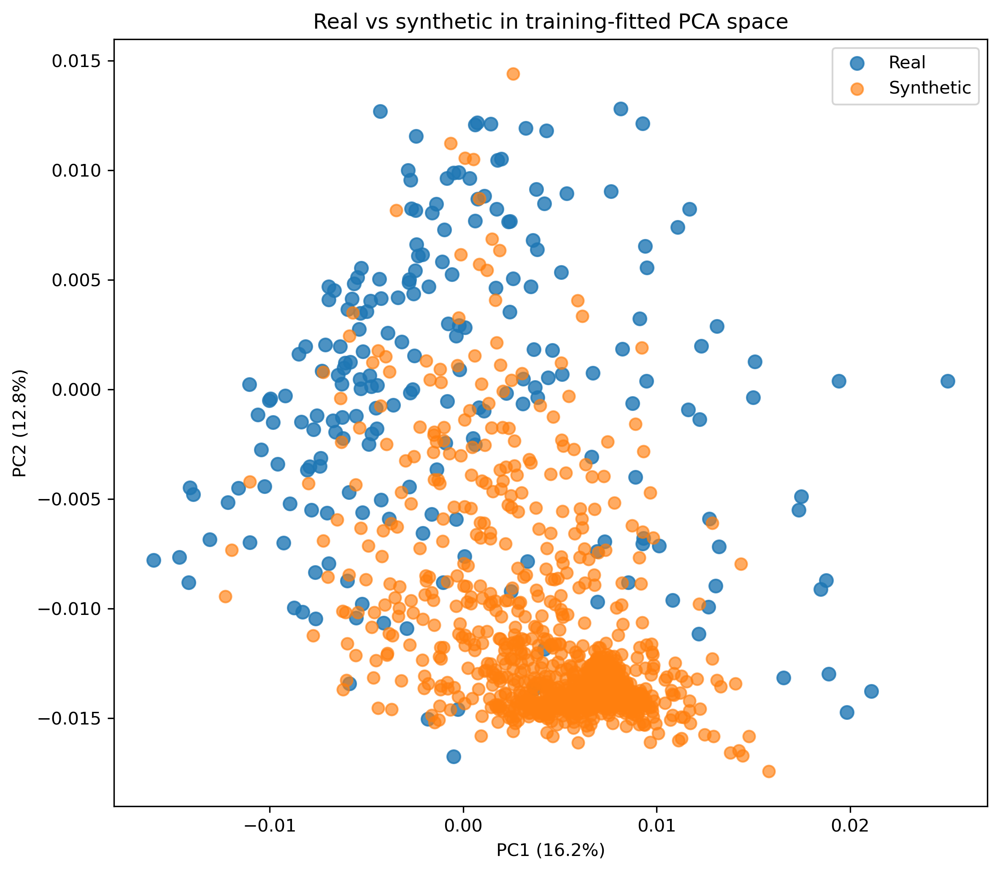
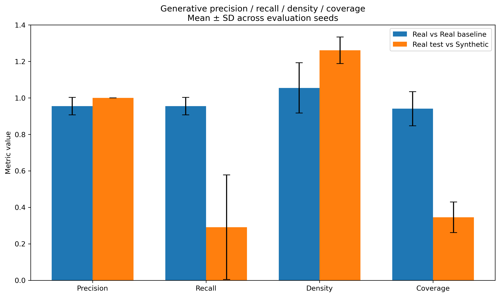
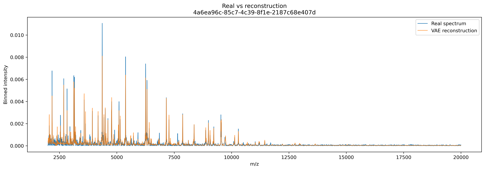
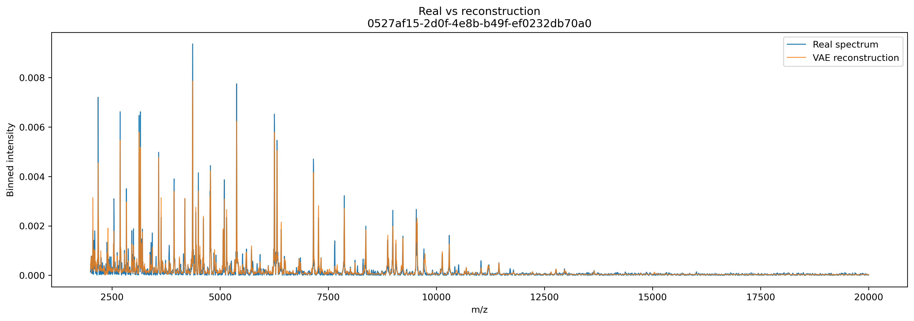
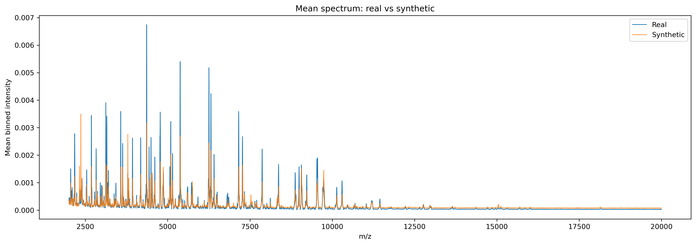

# DRIAMS MALDI-TOF Synthetic Spectrum Generation with a Dense β-VAE


This repository contains the code used for a master's course project on
synthetic MALDI-TOF spectrum generation for antimicrobial-resistance research.

## Study cohort

- Dataset: DRIAMS-B (2018)
- Species: *Escherichia coli*
- Antibiotic: ceftriaxone
- Final spectra: 213
- Representation: 6000 bins
- m/z interval: 2000–20000
- Bin width: 3 Da
- Binary labels: S -> 0, I/R -> 1

The VAE itself is unconditional; the resistance labels are used for
stratified splitting and downstream bookkeeping.

## Preprocessing

The MaldiAMRKit pipeline is:

1. square-root variance stabilization
2. Savitzky-Golay smoothing (window 21, polynomial order 3)
3. SNIP baseline correction (half-window 20)
4. TIC normalization
5. trimming to 2000–20000 m/z
6. 3 Da binning to 6000 features

The generated preprocessing and binned spectra are compared with the official
DRIAMS files.

## Model

Dense β-VAE:

`6000 -> 512 -> 128 -> 64 -> latent(16) -> 64 -> 128 -> 512 -> 6000`

- activations: GELU
- decoder output: Softplus
- baseline beta: 0.10
- selected beta after sweep: 0.01
- split seed: 42
- train / validation / test: 169 / 22 / 22

## Reproduction order

Run from the repository root:

```bash
python scripts/01_prepare_data.py
python scripts/02_train_baseline.py
python scripts/03_beta_sweep.py
python scripts/04_descriptive_evaluation.py
python scripts/05_formal_evaluation.py
```

The default data root is `DRIAMS-B/`. To use another location:

```bash
python scripts/01_prepare_data.py --driams-root /path/to/DRIAMS-B
```

## Formal generative evaluation

The final β=0.01 model is frozen. Formal evaluation uses only the held-out
22-spectrum test set.

- PCA is fitted only on real training spectra.
- PCA dimension: 5
- adapted Fréchet metric: PCA Fréchet Distance (PCA-FD), not image FID
- generative precision, recall, density, coverage
- k = 3 for PRDC neighborhoods
- evaluation seeds: 0–9
- 22 synthetic spectra per seed
- real-vs-real baseline: held-out test split into 11 + 11
- generated spectra are TIC-normalized before formal comparison

Final values from the latest completed experiment are:

- PCA-FD real-real baseline, 11 vs 11: `0.000108073 ± 4.76338e-05`
- PCA-FD real-synthetic matched, 11 vs 11: `0.00040362 ± 4.70615e-05`
- PCA-FD real test-synthetic, 22 vs 22: `0.00037688 ± 4.53183e-05`
- Precision: `1.000000 ± 0.000000`
- Recall: `0.290909 ± 0.286840`
- Density: `1.26061 ± 0.0727693`
- Coverage: `0.345455 ± 0.0835397`

The five PCA components explain approximately `48.49%` of the variance in the
real training spectra. The matched real-vs-synthetic PCA-FD is substantially
larger than the real-vs-real reference, while precision is perfect and recall
and coverage are much lower. This supports the main project finding: generated
spectra lie in realistic regions of the real-data feature space, but the frozen
β=0.01 generator reproduces only part of the diversity present in the held-out
real spectra.

## Environment

Install the packages in `requirements.txt`. For the exact environment used for
the final report, record the versions from the machine that produced the
results:

```bash
python --version
pip freeze > requirements-lock.txt
```

Commit `requirements-lock.txt` together with the repository.

## Data

The DRIAMS dataset is not distributed with this repository.
(you can download it here:  https://datadryad.org/dataset/doi:10.5061/dryad.bzkh1899q )
Download DRIAMS-B separately and preserve the original structure then put it in scripts folder:

```text
DRIAMS-B/
├── raw/
│   └── 2018/
├── preprocessed/
│   └── 2018/
├── binned_6000/
│   └── 2018/
└── id/
    └── 2018/
        └── 2018_clean.csv
```

The repository scripts create additional local folders:

```text
DRIAMS-B/
├── preprocess_MaldiAMRKit/
├── binned_6000_MaldiAMRKit/
├── bin_comparison/
├── vae_data/
└── vae_results/
```

## Repository design

The `maldi_vae/` directory is a small local library containing the reusable
implementation. The `scripts/` directory contains the five scientific
experiments in execution order.

## PCA: real vs synthetic spectra



The PCA projection was fitted only on the real training spectra and then used to project both real and TIC-normalized synthetic spectra. The synthetic samples overlap with the real-data distribution, showing that the VAE generates spectra in realistic regions of the learned feature space.

However, the synthetic spectra are more concentrated in a narrower region than the real spectra. This indicates reduced synthetic diversity and is consistent with the quantitative results showing high precision but lower recall and coverage.


## Generative precision, recall, density, and coverage



The synthetic spectra achieve very high precision (**1.00**) and relatively high density (**1.26**), indicating that generated samples lie in well-supported regions of the real-data distribution. In contrast, recall (**0.291**) and coverage (**0.345**) are much lower than the real-vs-real baseline.

This combination suggests that the model produces realistic spectra but captures only a limited fraction of the full variability present in the held-out real data. The main limitation is therefore reduced diversity rather than poor sample realism.


## Example VAE reconstructions





These examples show that the VAE reproduces the main MALDI-TOF peak locations and overall spectral structure of held-out real spectra. The selected β = 0.01 model achieved a median test reconstruction Pearson correlation of approximately **0.936**.

Some high-intensity peaks are underestimated and smaller spectral details are smoothed, which is expected from the compression imposed by the latent representation. Overall, the reconstructions show that the model learned the dominant spectral patterns well.


## Mean real vs synthetic spectrum



The mean synthetic spectrum reproduces many of the dominant peak locations observed in the real data, showing that the VAE captures important population-level spectral structure. After TIC normalization, the Pearson correlation between the real and synthetic mean spectra was approximately **0.878**.

Differences remain in peak amplitudes and background intensity, indicating that the generator does not reproduce the population distribution perfectly. This is consistent with the formal evaluation, where synthetic spectra were realistic but showed reduced coverage of real-data diversity.
